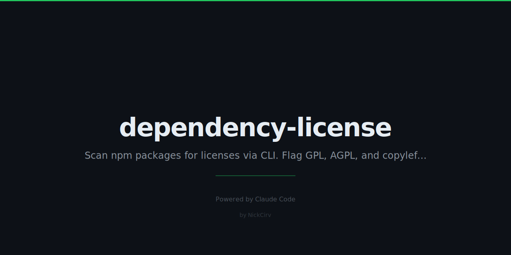

# dependency-license

> Scan npm dependencies for licenses. Flag GPL, AGPL, copyleft. Zero dependencies.

Zero external dependencies. Pure Node.js (18+). Works with npm and yarn projects.

## Install

```bash
# Run without installing
npx dependency-license

# Install globally
npm install -g dependency-license
```

## Quick Start

```
$ dlicense

Package                      Version   License              Risk
────────────────────────────────────────────────────────────────
some-gpl-lib                 1.0.0     GPL-3.0              ⚠ FLAGGED
express                      4.18.2    MIT                  ✓
chalk                        5.3.0     MIT                  ✓
unknown-pkg                  2.1.0     UNKNOWN              ?

Total: 4  Unique licenses: 3  Unknown: 1  Flagged: 1
```

## Options

| Flag | Description | Default |
|------|-------------|---------|
| `--allow "MIT,Apache-2.0,ISC"` | Flag any license NOT in this list | — |
| `--deny "GPL,AGPL,LGPL"` | Flag if any denied license found, exit 1 | Copyleft auto-flagged |
| `--format table\|json\|csv` | Output format | `table` |
| `--output <file>` | Save report to file | stdout |
| `--production` | Only check non-devDependencies | false |
| `--depth <n>` | Scan depth (1 = direct deps only) | all |
| `--cwd <path>` | Project root (default: current directory) | `process.cwd()` |
| `-h, --help` | Show help | — |

## Examples

```bash
# Default scan — flags all copyleft
dlicense

# Strict allowlist — flags anything not in the list
dlicense --allow "MIT,Apache-2.0,ISC,BSD-2-Clause,BSD-3-Clause"

# Explicit denylist — exit code 1 if any GPL/AGPL/LGPL found
dlicense --deny "GPL,AGPL,LGPL"

# Production deps only, direct only, JSON output
dlicense --production --depth 1 --format json

# Export CSV manifest for compliance
dlicense --format csv --output licenses.csv

# Scan a different project
dlicense --cwd /path/to/other/project
```

## License Risk Levels

| Icon | Meaning |
|------|---------|
| `✓` | Allowed or not flagged |
| `⚠ FLAGGED` | Matches deny list or copyleft detected |
| `?` | License could not be determined |

## License Detection

Reads from two sources in order:

1. `package.json` — `license` field (SPDX identifier preferred)
2. `LICENSE` / `LICENSE.md` / `LICENSE.txt` — scans first 600 chars for known patterns

Detected licenses: MIT, ISC, Apache-2.0, BSD-2-Clause, BSD-3-Clause, GPL-2.0, GPL-3.0, AGPL-3.0, LGPL-2.1, LGPL-3.0, MPL-2.0, CC0-1.0, Unlicense, WTFPL

## Exit Codes

| Code | Meaning |
|------|---------|
| `0` | All licenses clean |
| `1` | Flagged licenses found |
| `2` | Error (missing node_modules, parse failure) |

## CI Usage

```yaml
# GitHub Actions example
- name: License check
  run: npx dependency-license --deny "GPL,AGPL,LGPL" --production
```

---

Built with Node.js · Zero dependencies · MIT License
